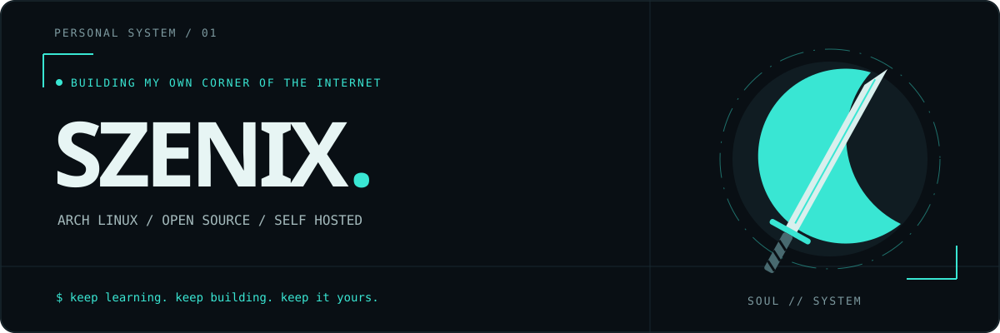

 <p align="center">
  
</p>

<p align="center">
  <a href="https://github.com/DenverCoder1/readme-typing-svg"></a>
</p>

<p align="center">
  <a href="https://archlinux.org/"></a>
  
  
  
</p>

<p align="center"><b>Hey, I'm Szenix.</b> I like systems I can understand, customize and run myself.<br/>Turquoise interfaces, Linux experiments, network tools 


### `01 / whoami`

```sh
szenix@arch ~ $ cat profile.conf

os        = Arch Linux
palette   = black / white / turquoise
interests = self-hosting, privacy, networks, open source
building  = Veyra — browser protection + local network dashboard
anime     = Bleach
approach  = learn → build → measure → improve
```

### `02 / on my workbench`

<p>
  
  
  
  
  
  
  
  
</p>

These are tools around my current projects, not a claim that I've mastered all of them.

### `03 / currently building`

<table>
<tr><td width="50%" valign="top">

#### ◇ Veyra Guard

An independent **uBlock Origin fork** with my own visual identity and popup interface. Browser request filtering, cosmetic filtering and scriptlets come from the upstream engine.

**Focus:** usable controls · clear diagnostics · tested filtering

`Firefox` · `JavaScript` · `GPLv3 upstream`

</td><td width="50%" valign="top">

#### ⌘ Veyra Panel

A local dashboard for understanding DNS activity: recognizable services, device aliases, draggable connection maps and compact charts.

**Focus:** understandable data · local processing · clean interfaces

`Python` · `HTML / CSS / JS` · `AdGuard Home`

</td></tr>
</table>

Both Veyra components are in development. DNS records indicate domain contact; they don't reveal the contents of an HTTPS connection.

#### Public repositories

- **[LinuxFIX](https://github.com/szen1zzz/LinuxFIX)** — a mobile Linux troubleshooting assistant with local error matching and optional Ollama analysis.
- **[linuxfix-config](https://github.com/szen1zzz/linuxfix-config)** — the public configuration repository.

[Browse my repositories →](https://github.com/szen1zzz?tab=repositories)

### `04 / the things I'm exploring`

| Area | What I'm working toward |
| :--- | :--- |
| **Networks** | Understanding DNS, clients, services and where blocking happens |
| **Browser extensions** | Learning the difference between requests, page elements and scriptlets |
| **Linux** | Making my Arch setup feel like my own |
| **Interfaces** | Smooth interactions, readable dashboards and useful statistics |
| **Open source** | Reproducible builds, clear documentation and proper upstream credits |


### `05 / after hours`

<details>
<summary><b>▸ A little more about my setup</b></summary>

- I prefer **turquoise accents** over loud gradients.
- I like customizing Linux and building tools I can run locally.
- I want network information to say something understandable, rather than just show a wall of domains.
- I care about whether a change actually helps — not just whether a test score looks bigger.
- I keep learning through projects, experiments and iteration.

</details>

<!-- LIVE_STATS:START -->

### `06 / public GitHub activity`

<p align="center">
  <a href="https://github.com/szen1zzz"></a>
  
</p>

<sub>Cards describe public GitHub data, not skill level. The third-party card service may be temporarily unavailable.</sub>

<!-- LIVE_STATS:END -->


<p align="center"><code>keep learning. keep building. keep it yours.</code></p>

<details>
<summary><sub>Credits &amp; inspiration</sub></summary>

Layout ideas and widget discovery: [Awesome GitHub Profile README](https://github.com/abhisheknaiidu/awesome-github-profile-readme). Animated text: [Readme Typing SVG](https://github.com/DenverCoder1/readme-typing-svg). Badges: [Shields.io](https://shields.io/), using [Simple Icons](https://github.com/simple-icons/simple-icons).

Veyra Guard's engine: [uBlock Origin](https://github.com/gorhill/uBlock), Raymond Hill and contributors. Network DNS protection: [AdGuard Home](https://github.com/AdguardTeam/AdGuardHome).

The banner and decorative SVGs are original assets for this profile. Bleach is referenced as a personal interest; this profile is not affiliated with its creators and contains no official anime artwork or logo.

</details>
